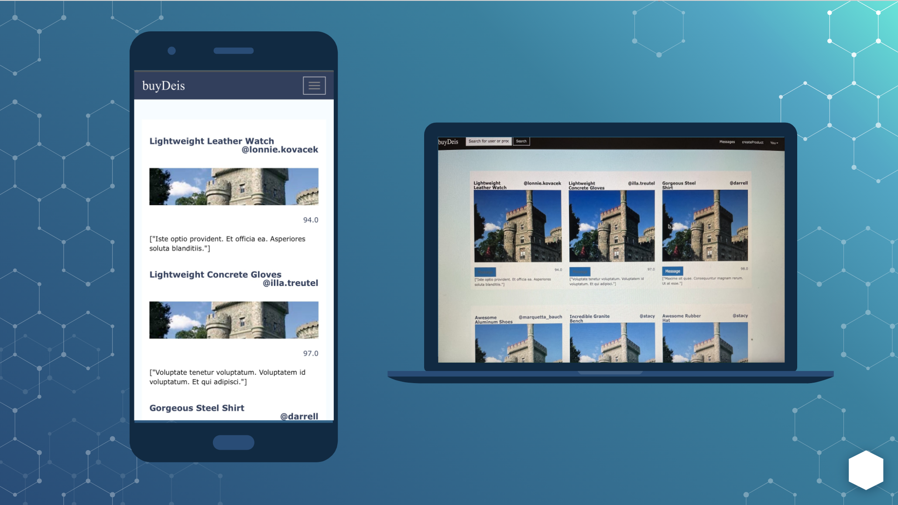

# buyDeis
> buyDeis is an application designed to provide the Brandeis student body with a space for trading/selling items that they are no longer in need of. 

## Table of contents
* [General info](#general-info)
* [Functionality and Features](#functionality)
* [URL Patterns](#url-patterns)
* [DB Schema](#db-schema)
* [Views](#views)
* [APIs, Gems, Libraries](#dependencies)
* [Code Examples](#code-examples)
* [To-do list](#to-do-list)
* [Prototypes and Screenshots](#screenshots)
* [Inspiration](#inspiration)
* [Setup](#setup)
* [Contact](#contact)

## General info
More than just your ordinary platform for buying, trading and selling, buyDeis is an app designed to cater for Brandeis students to connect with each other through their presence of the creations and goods that they sell online. Every semester, people throw out perfectly good products just because they do not want to bring them home or simply do not need them. buyDeis aims to match resources for Brandeis people and help out students that cannot afford new products, as well as promote sustainability on our campus.

## Functionality 
When entering buyDeis, users are allowed to create posts to sell/trade and see the feed for items that are available for purchase or exchange. The platform allows users to message each other for products and socializing, and gives users the option to search for specific items or users. On top of that, users can perform transactions on products(in progress) and leave reviews for them so they can build credibility(in progress).

Our Features Include...
* Sign up 
* Sign in
* Homepage with feed of products
* Create Product
* Profile page
* Message
* Search 
* Log out 

## URL Patterns

## DB Schema
* Users - first name(str), last name(str), email(str), password(str), username(str) 
* Products - name(str), description(str), price(float), user id(int), category id(int), status(boolean), quantity(int)
* Categories - name(str), description(str)

gems used in schema.rb
* Active Storage - storing images like profile pictures, product images
* Mailboxer - storing, sending, and receiving messages 

* User --> Product
    * In this relationship, a User can have many Products, and a Product can only belong to one User(a seller). It is a One-to-many Relationship.
* Category --> Product
    * In this relationship, a Category can have many products, and a Product can only have one Category. It is a Many-to-one Relationship.

## Views
* Implemented Views
    * views/conversations - shows conversations and messages between each other
    index and show occur side by side for ease of use
    index - Shows all conversations
    _sidebar - rendered in index 
    _indmessage - rendered in show
    show - shows the messages from users to each other  
    new - Display to start a new conversation 

    * views/layouts
    application - universal HTML code across our pages, calls _navbar and _footer
    _footer - partial for the bottom of our pages
    _navbar - top tab navigation partial

    * views/products - 
    edit - users can edit the product 
    index - where the card of each product is created
    _listAll - partial for listing all products posted, is called in welcome
    _form - partial for form to post a product online
    new - allows user to create/post a product, calls the _form partial 

     * views/sessions
    new - login page form
    
    * views/users
    mypage - profile page that shows profile picture, username, name, and cards of the products that they are selling 
    _form - partial for signup form 
    new-  signup page, form partial is called here
    index, show, edit  - users to list, destroy, edit  

    * views/welcome
    index - Where users are directed, shows all products posted with partial _listAll in products, <%= render '/products/listAll' %>

    * views/categories
    _form - 
    index -
    new, show, edit 

* Planned Views
    * views/reviews
    new - fill out review form
    index - displays a review card

    * views/transactions

## Dependencies
* Mailboxer 
    * Allows any object created with a acts_as_messageable property to have a mailbox. This means they can send and receive messages. The can also have conversations with other users. This is implemented with the messages and conversations controllers and views
* Active Storage 
    * Allows us to upload files, in our case images, and store the data of the files. By default, it stores the data locally, which why we used google cloud to  store it on the cloud.
* Google Cloud Storage 
    * Used Google Cloud Storage and created a bucket to store all images uploaded on the site. Added this to our storage.yml file with the specific encryption data given by google so all images stored in the site are saved.
* Bcrypt 
    * Allows us to encrypt user passwords and ensures all user password created are correct

## Code Examples
Show examples of usage:
`put-your-code-here`

## To-do list:
* Transactions
* Reviews and Ratings

## Prototype and Screenshots
[View Figma Prototypes Here](./prototypes-figma.pdf)

## Inspiration
[Depop](https://www.depop.com/),
[Poshmark](https://poshmark.com/)

## Setup

## Creators
Created by [@fatumata](), [@yalda](), [@sophia]()

